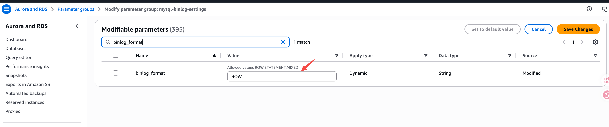

---
{
    "title": "Amazon Aurora MySQL",
    "language": "en",
    "description": "Prerequisites for configuring Binlog on Amazon Aurora MySQL to support Doris continuous load."
}
---

## Overview

Before using Doris continuous load to synchronize data from Amazon Aurora MySQL, you need to ensure that the Aurora cluster has Binlog enabled and properly configured. This guide walks you through all prerequisite configuration steps.

## Step 1: Check Current Configuration

First, check whether Binlog is enabled and the format is correct by connecting to the Aurora writer instance and running:

```sql
-- Check if binlog is enabled
SHOW VARIABLES LIKE 'log_bin';

-- Check binlog format
SHOW VARIABLES LIKE 'binlog_format';

-- Check binlog row image
SHOW VARIABLES LIKE 'binlog_row_image';
```

If `log_bin` is `ON`, `binlog_format` is `ROW`, and `binlog_row_image` is `FULL`, no additional configuration is needed. You can skip to [Step 4: Create Sync User](#step-4-create-sync-user).

Otherwise, continue with the following steps. Aurora MySQL does not enable Binlog by default and requires a cluster parameter group to enable it.

## Step 2: Configure Cluster Parameter Group

1. Log in to the [AWS RDS Console](https://console.aws.amazon.com/rds/).
2. In the left navigation, select **Parameter groups**, then click **Create parameter group**.
3. Select type **DB Cluster Parameter Group** and the appropriate Aurora MySQL version family.
4. Edit the cluster parameter group, search for `binlog_format`, and set the value to `ROW`:



5. Also search for `binlog_row_image` and set the value to `FULL`.
6. Click **Save Changes**.

## Step 3: Apply Cluster Parameter Group and Restart

1. In the RDS console, select the target Aurora cluster and click **Modify**.
2. Under **DB cluster parameter group**, select the newly created cluster parameter group.
3. Select **Apply immediately** to apply changes.
4. Restart the Aurora writer instance for the changes to take effect.

:::caution
Modifying the `binlog_format` parameter requires restarting the Aurora writer instance to take effect. Please perform this during off-peak hours.
:::

## Step 4: Create Sync User

Create a dedicated user for Doris continuous load:

```sql
CREATE USER 'doris_sync'@'%' IDENTIFIED BY '<password>';
```

Grant the required permissions:

```sql
GRANT SELECT, REPLICATION SLAVE, REPLICATION CLIENT ON *.* TO 'doris_sync'@'%';
```

## Step 5: Configure Binlog Retention

It is recommended to set the Binlog retention time to at least 72 hours to ensure binary log files are still available for replication in failure scenarios.

Use the `mysql.rds_set_configuration` stored procedure to set the retention time:

```sql
CALL mysql.rds_set_configuration('binlog retention hours', 72);
```

:::caution
If this configuration is not set, or is set to a too-short interval, it may cause gaps in the binary logs, which could affect Doris's ability to recover replication.
:::
