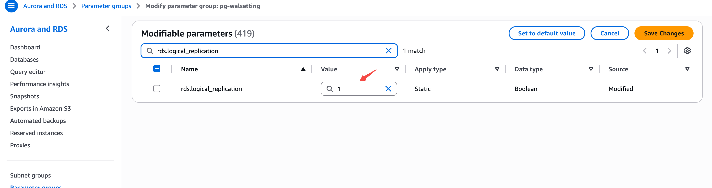

---
{
    "title": "Amazon Aurora PostgreSQL",
    "language": "en",
    "description": "Prerequisites for configuring logical replication on Amazon Aurora PostgreSQL to support Doris continuous load."
}
---

## Overview

Before using Doris continuous load to synchronize data from Amazon Aurora PostgreSQL, you need to ensure that the Aurora cluster has logical replication enabled. This guide walks you through all prerequisite configuration steps.

## Step 1: Check Current Configuration

First, check whether logical replication is enabled by connecting to the Aurora writer instance and running:

```sql
SHOW rds.logical_replication;
```

If the result is `on`, no parameter group changes are needed. You can skip to [Step 4: Create Sync User](#step-4-create-sync-user).

If the result is `off`, continue with the following steps.

## Step 2: Configure Cluster Parameter Group

1. Log in to the [AWS RDS Console](https://console.aws.amazon.com/rds/).
2. In the left navigation, select **Parameter groups**, then click **Create parameter group**.
3. Select type **DB Cluster Parameter Group** and the appropriate Aurora PostgreSQL version family.
4. Edit the cluster parameter group, search for `rds.logical_replication`, and set the value to `1`:



5. Click **Save Changes**.

## Step 3: Apply Cluster Parameter Group and Restart

1. In the RDS console, select the target Aurora cluster and click **Modify**.
2. Under **DB cluster parameter group**, select the newly created cluster parameter group.
3. Select **Apply immediately** to apply changes.
4. Restart the Aurora writer instance for the changes to take effect.

:::caution
Modifying the `rds.logical_replication` parameter requires restarting the Aurora writer instance to take effect. Please perform this during off-peak hours.
:::

## Step 4: Create Sync User

Create a dedicated user for Doris continuous load:

```sql
CREATE USER doris_sync PASSWORD '<password>';
```

Grant schema access permissions (using `public` schema as an example, replace as needed):

```sql
GRANT USAGE ON SCHEMA "public" TO doris_sync;
GRANT SELECT ON ALL TABLES IN SCHEMA "public" TO doris_sync;
ALTER DEFAULT PRIVILEGES IN SCHEMA "public" GRANT SELECT ON TABLES TO doris_sync;
```

Grant replication permission:

```sql
GRANT rds_replication TO doris_sync;
```

## Step 5: Create Publication

Run the following SQL to create a Publication:

```sql
CREATE PUBLICATION dbz_publication FOR ALL TABLES;
```

:::caution
Currently Doris only supports the Publication named `dbz_publication` with `FOR ALL TABLES`. Custom Publication names or specifying individual tables are not supported.
:::

> **Note:** If the sync user has superuser privileges (e.g., the `rds_superuser` role), Doris will automatically create the Publication and this step can be skipped.
